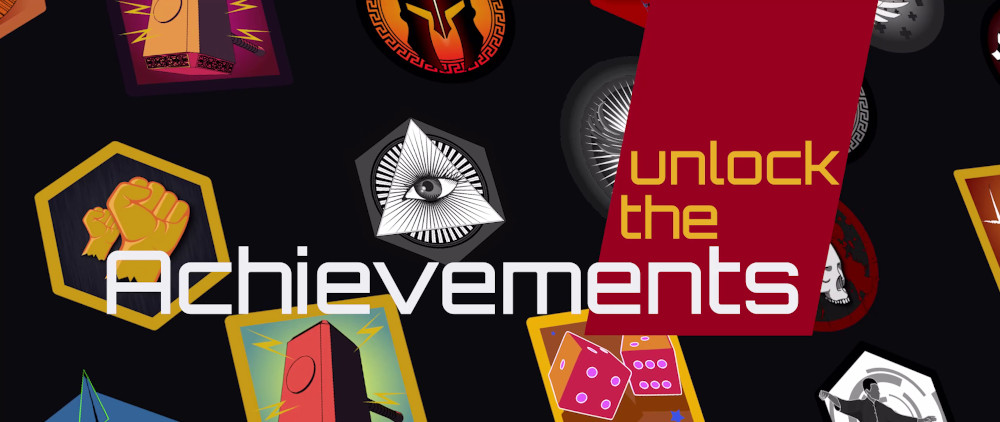

# DIAMBRA Docs

<figure style="margin-bottom:40px; margin-top:0px; margin-right:auto; margin-left:auto; width: 100%;">
  
</figure>

## DIAMBRA Arena

### Index

<div style="font-size:1.125rem;">

- <a href="./#overview">Overview</a>
- <a href="./#installation">Installation</a>
- <a href="./#quickstart">Quickstart</a>
- <a href="./#examples">Examples</a>
- <a href="./#rl-libs-compatibility--state-of-the-art-agents">RL Libs Compatibility & State-of-the-Art Agents</a>
- <a href="./#competition-platform">Competition Platform</a>
- <a href="./#docs-structure">Docs Stucture</a>
- <a href="./#support-feature-requests--bugs-reports">Support, Feature Requests & Bugs Reports</a>
- <a href="./#references">References</a>
- <a href="./#citation">Citation</a>
- <a href="./#terms-of-use">Terms of Use</a>

</div>

### Overview

DIAMBRA Arena is a software package featuring a collection of <span style="color:#333333; font-weight:bolder;">high-quality environments for Reinforcement Learning research and experimentation</span>. It provides a standard interface to popular arcade emulated video games, offering a <span style="color:#333333; font-weight:bolder;">Python API fully compliant with OpenAI Gym/Gymnasium format</span>, that makes its adoption smooth and straightforward.

It <span style="color:#333333; font-weight:bolder;">supports all major Operating Systems</span> (Linux, Windows and MacOS) and <span style="color:#333333; font-weight:bolder;">can be easily installed via Python PIP</span>, as described in the <a href="./#installation">installation section</a> below. It is <span style="color:#333333; font-weight:bolder;">completely free to use</span>, the user only needs to register on the official website.

In addition, its <a href="https://github.com/diambra/arena" target="_blank">GitHub repository</a> provides a <span style="color:#333333; font-weight:bolder;">collection of examples</span> covering main use cases of interest <span style="color:#333333; font-weight:bolder;">that can be run in just a few steps</span>.

<figure style="margin-bottom:40px; margin-top:0px; margin-right:auto; margin-left:auto; width: 80%;">
  
  <figcaption align="middle">Agent-Environment Interaction Scheme</figcaption>
</figure>

#### Main Features

All environments are episodic Reinforcement Learning tasks, with discrete actions (gamepad buttons) and observations composed by screen pixels plus additional numerical data (RAM values like characters health bars or characters stage side).

They all <span style="color:#333333; font-weight:bolder;">support both single player (1P) as well as two players (2P) mode</span>, making them the perfect resource to explore all the following Reinforcement Learning subfields:

<div style="margin-bottom:0px;">
  <figure style="padding:2px; margin-right:auto; margin-left:auto; float:left; min-width:110px; max-width:15%; min-height:120px;">
   
   <figcaption align="middle">Standard RL</figcaption>
  </figure>
  <figure style="padding:2px; margin-right:auto; margin-left:auto; float:left; min-width:110px; max-width:15.0%; min-height:120px;">
   
   <figcaption align="middle">Competitive Multi-Agent</figcaption>
  </figure>
  <figure style="padding:2px; margin-right:auto; margin-left:auto; float:left; min-width:110px; max-width:15.0%; min-height:120px;">
   
   <figcaption align="middle">Competitive Human-Agent</figcaption>
  </figure>
  <figure style="padding:2px; margin-right:auto; margin-left:auto; float:left; min-width:110px; max-width:15.0%; min-height:120px;">
   
   <figcaption align="middle">Self-Play</figcaption>
  </figure>
  <figure style="padding:2px; margin-right:auto; margin-left:auto; float:left; min-width:110px; max-width:15.0%; min-height:120px;">
   
   <figcaption align="middle">Imitation Learning</figcaption>
  </figure>
  <figure style="padding:2px; margin-right:auto; margin-left:auto; float:left; min-width:110px; max-width:15.0%; min-height:120px;">
   
   <figcaption align="middle">Human-in-the-Loop</figcaption>
  </figure>
</div>

#### Available Games

Interfaced games have been selected among the most popular fighting retro-games. While sharing the same fundamental mechanics, they provide different challenges, with specific features such as different type and number of characters, how to perform combos, health bars recharging, etc.

Whenever possible, games are released with all hidden/bonus characters unlocked.

Additional details can be found in their <a href="./envs/games/">dedicated section</a>.

<div>
  <figure style="margin-right:1%; margin-left:auto; float:left; width:15.0%">
   <a href="./envs/games/"></a>
  </figure>
  <figure style="margin-right:1%; margin-left:1%; float:left; width:15.0%;">
   <a href="./envs/games/"></a>
  </figure>
  <figure style="margin-right:1%; margin-left:1%; float:left; width:15.0%;">
   <a href="./envs/games/"></a>
  </figure>
  <figure style="margin-right:1%; margin-left:1%; float:left; width:15.0%;">
   <a href="./envs/games/"></a>
  </figure>
  <figure style="margin-right:1%; margin-left:1%; float:left; width:15.0%;">
   <a href="./envs/games/"></a>
  </figure>
  <figure style="margin-right:auto; margin-left:1%; float:left; width:15.0%;">
   <a href="./envs/games/"></a>
  </figure>
</div>

### Installation

- <a href="https://diambra.ai/register/" target="_blank">Register on our website</a>, it requires just a few clicks and is 100% free

- Install Docker Desktop (<a href="https://docs.docker.com/desktop/install/linux-install/" target="_blank">Linux</a> | <a href="https://docs.docker.com/desktop/windows/install/" target="_blank">Windows</a> | <a href="https://docs.docker.com/desktop/mac/install/" target="_blank">MacOS</a>) and <span style="color:#333333; font-weight:bolder;">make sure you have permissions to run it</span> (<a href="https://docs.docker.com/engine/install/linux-postinstall/" target="_blank">see here</a>). On Linux, it's usually enough to run `sudo usermod -aG docker $USER`, log out and log back in.

- Install DIAMBRA Command Line Interface: `python3 -m pip install diambra`

- Install DIAMBRA Arena: `python3 -m pip install diambra-arena`

{}
Using a virtual environment to isolate your python packages installation is strongly suggested
{}

### Quickstart

##### Download Game ROM(s) and Check Validity

Check available games with the following command:

```shell
diambra arena list-roms
```

Output example:

```shell
[...]
 Title: Dead Or Alive ++ - GameId: doapp
   Difficulty levels: Min 1 - Max 4
   SHA256 sum: d95855c7d8596a90f0b8ca15725686567d767a9a3f93a8896b489a160e705c4e
   Original ROM name: doapp.zip
   Search keywords: ['DEAD OR ALIVE ++ [JAPAN]', 'dead-or-alive-japan', '80781', 'wowroms']
   Characters list: ['Kasumi', 'Zack', 'Hayabusa', 'Bayman', 'Lei-Fang', 'Raidou', 'Gen-Fu', 'Tina', 'Bass', 'Jann-Lee', 'Ayane']
[...]
```

{}
If you are using Windows 10 "N" editions and get this error `ImportError: DLL load failed while importing cv2`, you might need to install the <a href=" https://support.microsoft.com/en-us/topic/media-feature-pack-list-for-windows-n-editions-c1c6fffa-d052-8338-7a79-a4bb980a700a" target="_blank">"Media Feature Pack".</a>
{}

Search ROMs on the web using <span style="color:#333333; font-weight:bolder;">Search Keywords</span> provided by the game list command reported above. <span style="color:#333333; font-weight:bolder;">Pay attention, follow game-specific notes reported there, and store all ROMs in the same folder, whose absolute path will be referred in the following as `/absolute/path/to/roms/folder/`</span>.

{}
Specific game ROM files are required, check validity of the downloaded ROMs as follows.
{}

Check ROM(s) validity running:

```shell
diambra arena check-roms /absolute/path/to/roms/folder/romFileName.zip
```

The output for a valid ROM file would look like the following:

```shell
Correct ROM file for Dead Or Alive ++, sha256 = d95855c7d8596a90f0b8ca15725686567d767a9a3f93a8896b489a160e705c4e
```

{}
Make sure to check out our <a href="https://diambra.ai/terms" target="_blank">Terms of Use</a>, and in particular Section 7. By using the software, you accept the in full.</span></ins>
{}

##### Base script

A Python script to run a complete episode with a random agent requires less than 20 lines:



To execute the script run:

```
diambra run -r /absolute/path/to/roms/folder/ python script.py
```

{}
To avoid specifying ROMs path at every run, you can define the environment variable `DIAMBRAROMSPATH=/absolute/path/to/roms/folder/`, either temporarily in your current shell/prompt session, or permanently in your profile (e.g. on linux in `~/.bashrc`).
{}

### Examples

We provide multiple examples covering the most important use-cases, that can be used as templates and starting points to explore all the features of the software package.

They show how to leverage both single and two players modes, how to set up environment wrappers with all their options, how to record human expert demonstrations and how to load them to apply imitation learning.

Every example has a <a href="/gettingstarted/examples/">dedicated page</a> in this documentation, and the source code is available in the <a href="https://github.com/diambra/arena/tree/main/examples" target="_blank">code repository.</a>

### RL Libs Compatibility & State-of-the-Art Agents

<figure style="margin-bottom:0px; margin-top:40px; margin-right:auto; margin-left:auto; width: 100%;">
  
</figure>

DIAMBRA Arena is built to maximize compatibility will all major Reinforcement Learning libraries. It natively provides interfaces with the two most import packages: Stable Baselines 3 and Ray RLlib, while Stable Baselines is also available but deprecated. Their usage is illustrated in detail in the <a href="/handsonreinforcementlearning/">dedicated section</a> of this documentation and in the <a href="https://github.com/diambra/agents" target="_blank">DIAMBRA Agents</a>  repository. It can easily be interfaced with any other package in a similar way.

Native interfaces, installed with the specific options listed below, are tested with the following versions:

- Stable Baselines 3 (2.1.0) | `pip install diambra-arena[stable-baselines3]` <a href="https://stable-baselines3.readthedocs.io/en/master/index.html" target="_blank">Docs</a>-<a href="https://github.com/DLR-RM/stable-baselines3" target="_blank">GitHub</a>-<a href="https://pypi.org/project/stable-baselines3/" target="_blank">Pypi</a>
- Ray RLlib (2.6.3) | `pip install diambra-arena[ray-rllib]` <a href="https://docs.ray.io/en/latest/index.html" target="_blank">Docs</a>-<a href="https://github.com/ray-project/ray" target="_blank">GitHub</a>-<a href="https://pypi.org/project/ray/" target="_blank">Pypi</a>
- Stable Baselines (2.10.2) | `pip install diambra-arena[stable-baselines]` <a href="https://stable-baselines.readthedocs.io/en/master/index.html" target="_blank">Docs</a>-<a href="https://github.com/hill-a/stable-baselines" target="_blank">GitHub</a>-<a href="https://pypi.org/project/stable-baselines/" target="_blank">Pypi</a>

### Competition Platform

<figure style="margin-bottom:0px; margin-top:40px; margin-right:auto; margin-left:auto; width: 100%;">
  
</figure>

Our competition platform allows you to submit your agents and compete with other coders around the globe in epic video games tournaments!

It features a public global leaderboard where users are ranked by the best score achieved by their agents in our different environments.

It also offers you the possibility to unlock cool achievements depending on the performances of your agent.

<figure style="margin-bottom:0px; margin-top:0px; margin-right:auto; margin-left:auto; width: 100%;">
  
</figure>

Submitted agents are evaluated and their episodes are streamed on <a href="https://www.twitch.tv/diambra_ai" target="_blank">our Twitch channel.</a>

We aimed at making the submission process as smooth as possible, <a href="./competitionplatform/howtosubmitanagent/">try it now!</a>

### Docs Structure

<div style="font-size:1.125rem;">

- <a href="./gettingstarted/">Getting Started</a>
- <a href="./envs/">Environments</a>
- <a href="./wrappers/">Wrappers</a>
- <a href="./utils/">Utils</a>
- <a href="./imitationlearning/">Imitation Learning</a>
- <a href="./handsonreinforcementlearning/">Hands-on Reinforcement Learning</a>
- <a href="./competitionplatform/">Competition Platform</a>
- <a href="./projects/">Projects</a>

</div>

### Support, Feature Requests & Bugs Reports

To receive support, use the dedicated channel in our <a href="https://diambra.ai/discord" target="_blank">Discord Server</a>.

To request features or report bugs, use GitHub discussions and issue trackers for the repositories:

- <a href="https://github.com/orgs/diambra/discussions" target="_blank">DIAMBRA Discussions</a>
- <a href="https://github.com/diambra/arena/issues" target="_blank">DIAMBRA Arena Issue Tracker</a>
- <a href="https://github.com/diambra/agents/issues" target="_blank">DIAMBRA Agents Issue Tracker</a>

### References

- Website: <a href="https://diambra.ai" target="_blank">https://diambra.ai</a>
- GitHub: <a href="https://github.com/diambra/" target="_blank">https://github.com/diambra/</a>
- Paper: <a href="https://arxiv.org/abs/2210.10595" target="_blank">https://arxiv.org/abs/2210.10595</a>
- Linkedin: <a href="https://www.linkedin.com/company/diambra" target="_blank">https://www.linkedin.com/company/diambra</a>
- Discord: <a href="https://diambra.ai/discord" target="_blank">https://diambra.ai/discord</a>
- Twitch: <a href="https://www.twitch.tv/diambra_ai" target="_blank">https://www.twitch.tv/diambra_ai</a>
- YouTube: <a href="https://www.youtube.com/c/diambra_ai" target="_blank">https://www.youtube.com/c/diambra_ai</a>
- Twitter: <a href="https://twitter.com/diambra_ai" target="_blank">https://twitter.com/diambra_ai</a>

### Citation

Paper: <a href="https://arxiv.org/abs/2210.10595" target="_blank">https://arxiv.org/abs/2210.10595</a>

```LaTex
@article{Palmas22,
    author = {{Palmas}, Alessandro},
    title = "{DIAMBRA Arena: a New Reinforcement Learning Platform for Research and Experimentation}",
    journal = {arXiv e-prints},
    keywords = {reinforcement learning, transfer learning, multi-agent, games},
    year = 2022,
    month = oct,
    eid = {arXiv:2210.10595},
    pages = {arXiv:2210.10595},
    archivePrefix = {arXiv},
    eprint = {2210.10595},
    primaryClass = {cs.AI}
 }
```

### Terms of Use

DIAMBRA Arena software package is subject to our <a href="https://diambra.ai/terms" target="_blank">Terms of Use</a>. By using it, you accept them in full.

###### DIAMBRA, Inc. © Copyright 2018-2023. All Rights Reserved.
