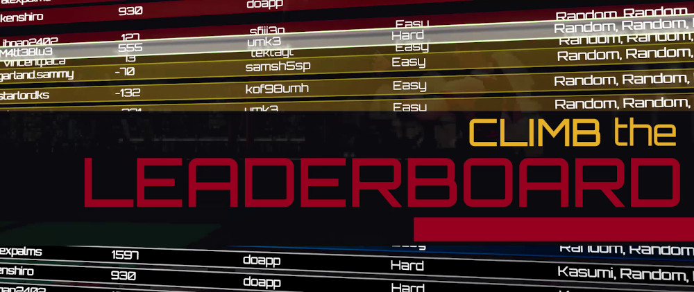
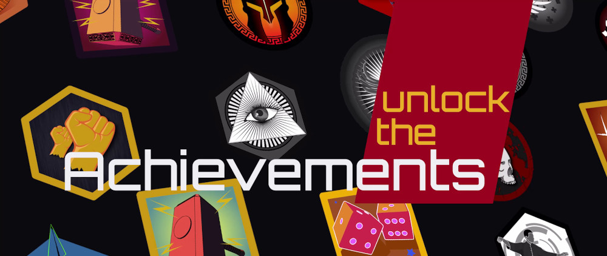

<figure style="margin-bottom:0px; margin-top:0px; margin-right:auto; margin-left:auto; width: 100%;">
  
</figure>

Our competition platform allows you to submit your agents and compete with other coders around the globe in epic video games tournaments!

It features a public global leaderboard where users are ranked by the best score achieved by their agents in our different environments. 

It also offers you the possibility to unlock cool achievements depending on the performances of your agent. 

<figure style="margin-bottom:0px; margin-top:0px; margin-right:auto; margin-left:auto; width: 100%;">
  
</figure>

Submitted agents are evaluated and their episodes are streamed on our Twitch channel.

We aimed at making the submission process as smooth as possible, try it now! You find all the details in the sub-pages linked below.

- <a href="./basicagentscript/">Basic Agent Script</a>
- <a href="./submissionevaluation/">Submission Evaluation</a>
- <a href="./howtosubmitanagent/">How to Submit an Agent</a>
- <a href="./argumentsandcommands/">Arguments and Commands</a>
- <a href="./testyouragentlocally">Test Your Agent Locally</a>

