### Index

<div style="font-size:1.125rem;">

- <a href="./#learning-reinforcement-learning">Learning RL</a>
- <a href="./#end-to-end-deep-reinforcement-learning">End-To-End DeepRL</a>

</div>

What is the best path leading a passionate coder to the creation of a trained AI agent capable of effectively playing a video game? It consists in two steps: learning reinforcement learning and applying it.

[Learning RL](./#learning-reinforcement-learning) section below deals with how to get started with RL: it presents resources that cover from the basics up to the most advanced details of the latest, best-performing algorithms.

Then, in the [End-to-end Deep Reinforcement Learning](./#end-to-end-deep-reinforcement-learning) section, some of the most important tech tools are presented together with a step-by-step guide showing how to successfully train a Deep RL agent in our environments.

### Learning Reinforcement Learning

#### Books

The first suggested step is to learn the basics of Reinforcement Learning. The best option to do so is Sutton & Barto's book "Reinforcement Learning: An Introduction", that can be considered the reference text for the field. An additional option is Packt's "The Reinforcement Learning Workshop" that covers theory but also a good amount of practice, being very hands-on and complemented by a GitHub repo with worked exercises.

<div>
  <figure style="margin-top:0px;margin-bottom:40px; margin-right:1%; margin-left:15%; float:left; width:35.0%">
   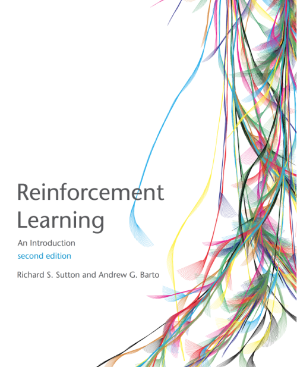
   <figcaption align="middle">Reinforcement Learning: An Introduction - Sutton & Barto • <a href="https://mitpress.mit.edu/books/reinforcement-learning-second-edition" target="_blank">Link</a></figcaption>
  </figure>
  <figure style="margin-top:0px;margin-bottom:40px; margin-right:auto; margin-left:1%; float:left; width:35.0%;">
   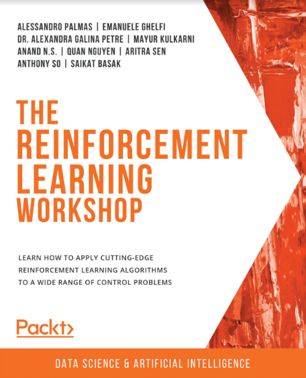
   <figcaption align="middle">The Reinforcement Learning Workshop - Palmas et al. • <a href="https://www.packtpub.com/product/the-reinforcement-learning-workshop/9781800200456" target="_blank">Link</a></figcaption>
  </figure>
</div>

#### Courses / Video-lectures

An additional useful resource is represented by courses and/or video-lectures. The three listed in this paragraph, in particular, are extremely valuable. The first one, "DeepMind Reinforcement Learning Lectures at University College London", is a collection of lectures dealing with RL in general, as Sutton & Barto's book, providing the solid foundations of the field. The second one, "OpenAI Spinning Up with Deep RL", is a very useful website providing a step-by-step primer focused on Deep RL, guiding the reader from the basics to understanding the most important algorithms down to the implementation details. The third one, "Berkeley Deep RL Bootcamp", provides video and slides dealing specifically with Deep RL too, and presents a wide overview of the most important, state-of-the-art methods in the field. These are all extremely useful and available for free.

<div>
  <figure style="margin-top:0px;margin-bottom:40px; margin-right:1%; margin-left:3%; float:left; width:30.0%">
   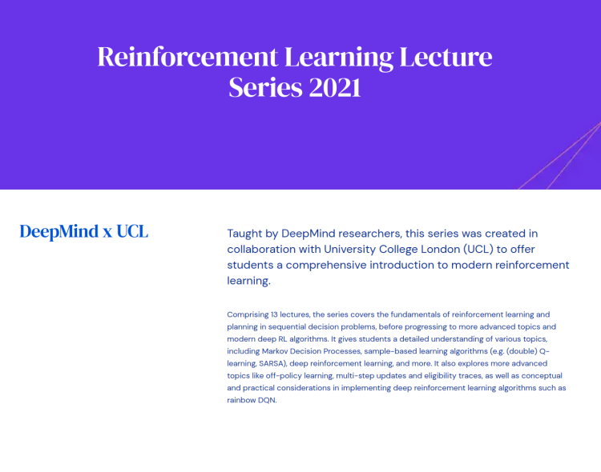
   <figcaption align="middle">DeepMind Reinforcement Learning Lectures at University College London • <a href="https://www.deepmind.com/learning-resources/reinforcement-learning-lecture-series-2021" target="_blank">Link</a></figcaption>
  </figure>
  <figure style="margin-top:0px;margin-bottom:40px; margin-right:1%; margin-left:1%; float:left; width:30.0%">
   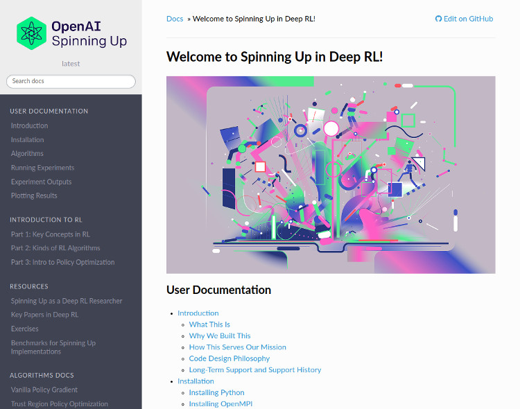
   <figcaption align="middle">OpenAI Spinning Up with Deep RL • <a href="https://spinningup.openai.com/en/latest/" target="_blank">Link</a></figcaption>
  </figure>
  <figure style="margin-top:0px;margin-bottom:40px; margin-right:auto; margin-left:1%; float:left; width:30.0%;">
   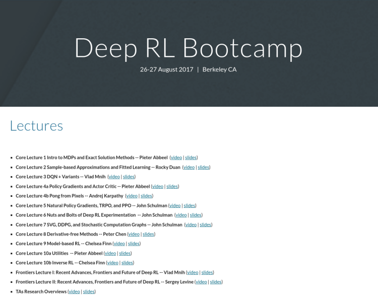
   <figcaption align="middle">Berkeley Deep RL Bootcamp • <a href="https://sites.google.com/view/deep-rl-bootcamp/lectures" target="_blank">Link</a></figcaption>
  </figure>
</div>

#### Research Publications

After having acquired solid fundamentals, as usual in the whole ML domain, one should rely on publications to keep the pace of field advancements. Conference papers, peer-reviewed journal and open access publications are all options to consider.

A good starting point is to read the reference paper for all state-of-the-art algorithms implemented in the most important [RL libraries (see next section)](/deeprltraining/endtoendtraining/#rl-libraries), as found for example <a href="https://stable-baselines3.readthedocs.io/en/master/guide/algos.html" target="_blank">here (SB3)</a> and <a href="https://docs.ray.io/en/latest/rllib/rllib-algorithms.html" target="_blank">here (RAY RLlib)</a>.

<div>
  <figure style="margin-top:0px;margin-bottom:40px; margin-right:1%; margin-left:3%; float:left; width:30.0%">
   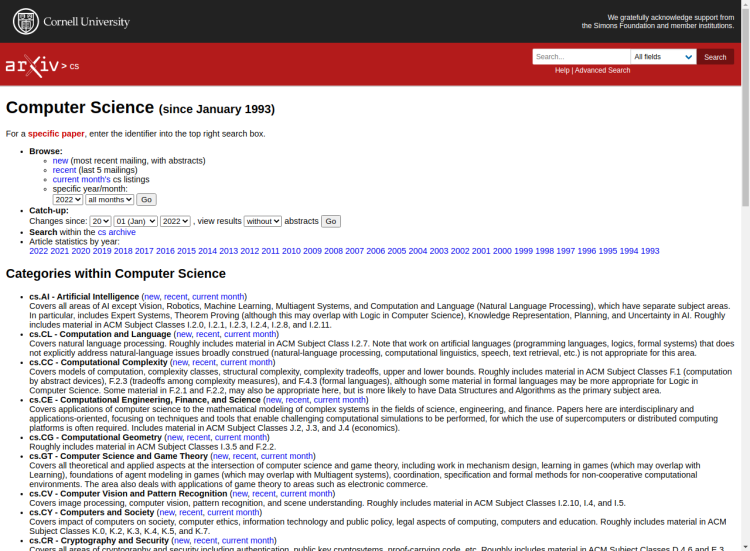
   <figcaption align="middle">Open Access (<a href="https://arxiv.org/search/cs" target="_blank">Arxiv</a>, etc.)</figcaption>
  </figure>
  <figure style="margin-top:0px;margin-bottom:40px; margin-right:1%; margin-left:1%; float:left; width:30.0%;">
   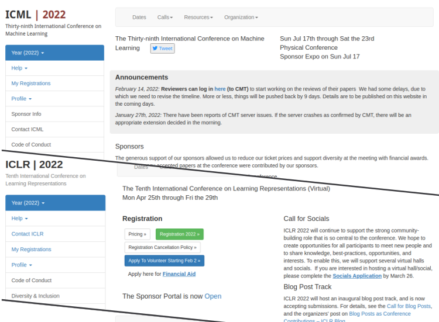
   <figcaption align="middle">International Conferences (<a href="https://icml.cc/" target="_blank">ICML</a>, <a href="https://nips.cc/" target="_blank">NeurIPS</a>, <a href="https://iclr.cc/" target="_blank">ICLR</a>, etc.)</figcaption>
  </figure>
  <figure style="margin-top:0px;margin-bottom:40px; margin-right:auto; margin-left:1%; float:left; width:30.0%;">
   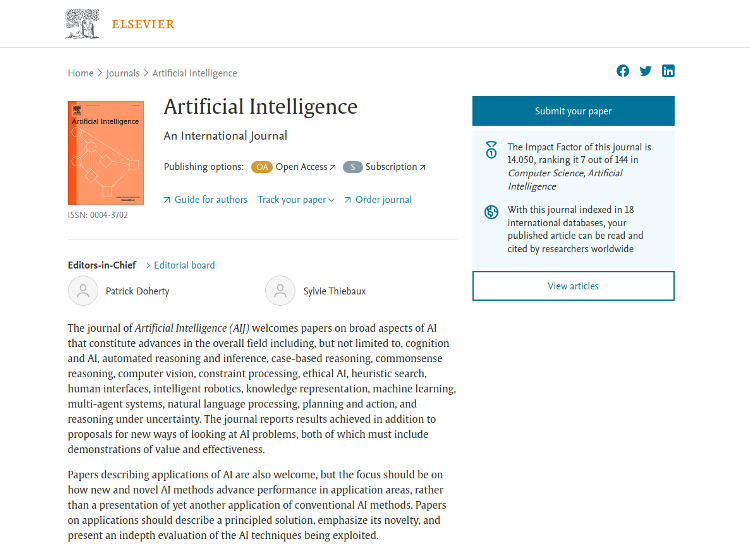
   <figcaption align="middle">Peer-reviewed Journals (<a href="https://www.journals.elsevier.com/artificial-intelligence" target="_blank">ELSEVIER</a>, <a href="https://www.springer.com/journal/10458" target="_blank">Springer</a>, etc.)</figcaption>
  </figure>
</div>

#### More

Finally, additional sources of useful information to better understand this field, and to get inspired by its great potential, are documentaries presenting notable milestones achieved by some of the best AI labs in the world. They showcase reinforcement learning masterpieces, such as AlphaGo/AlphaZero, OpenAI Five and Gran Turismo Sophy, mastering the games of Go, DOTA 2 and Gran Turismo® 7 respectively.

<div>
  <figure style="margin-top:0px;margin-bottom:40px; margin-right:1%; margin-left:3%; float:left; width:30.0%">
   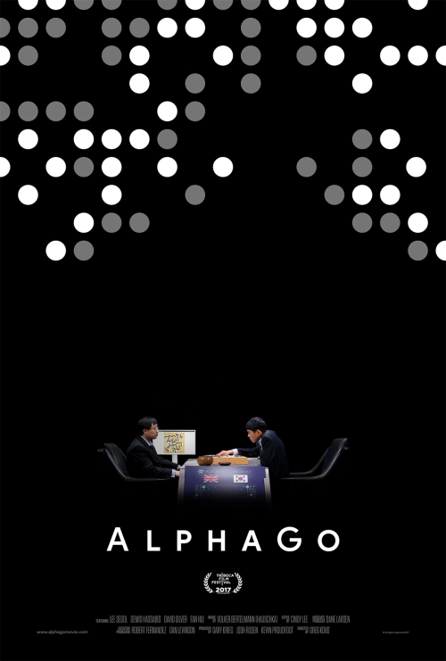
   <figcaption align="middle">DeepMind<br>AlphaGo The Movie • <a href="https://www.youtube.com/watch?v=WXuK6gekU1Y" target="_blank">Link</a></figcaption>
  </figure>
  <figure style="margin-top:0px;margin-bottom:40px; margin-right:1%; margin-left:1%; float:left; width:30.0%">
   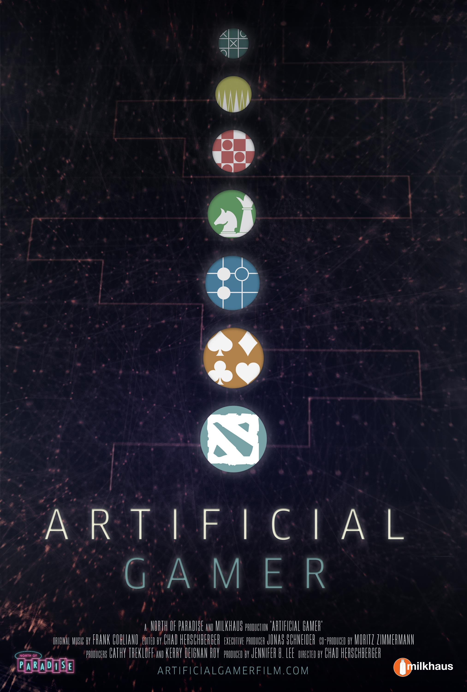
   <figcaption align="middle">OpenAI<br>Artificial Gamer • <a href="https://youtu.be/J0KPNpro2J8?t=1211" target="_blank">Link</a></figcaption>
  </figure>
  <figure style="margin-top:0px;margin-bottom:40px; margin-right:auto; margin-left:1%; float:left; width:30.0%">
   
   <figcaption align="middle">Sony AI<br>Gran Turismo® Sophy • <a href="https://www.youtube.com/watch?v=qP1gjgtKyYc&ab_channel=SonyAI" target="_blank">Link</a></figcaption>
  </figure>
</div>

### End-to-End Deep Reinforcement Learning

#### Reinforcement Learning Libraries

If one wants to rely on already implemented RL algorithms, focusing his efforts on higher level aspects such as policy network architecture, features selection, hyper-parameters tuning, and so on, the best choice is to leverage state-of-the-art RL libraries as the ones shown below. There are many different options, here we list those that, in our experience, are recognized as the leaders in the field, and have been proven to achieve good performances in DIAMBRA Arena environments.

There are multiple advantages related to the use of these libraries, to name a few: they provide high quality RL algorithms, efficiently implemented and continuously tested, they allow to natively parallelize environment execution, and in some cases they even support distributed training using multiple GPUs in a single workstation or even in cluster contexts.

The next section provides guidance and examples using some of the options listed down here.

<div>
  <figure style="margin-top:0px;margin-bottom:40px; margin-right:1%; margin-left:3%; float:left; width:30.0%">
   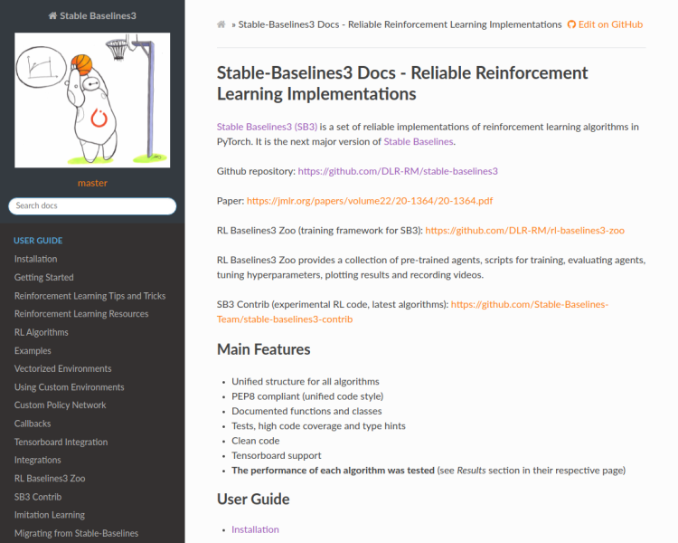
   <figcaption align="middle">Stable Baselines 3 • <a href="https://stable-baselines3.readthedocs.io/en/master/" target="_blank">Link</a></figcaption>
  </figure>
  <figure style="margin-top:0px;margin-bottom:40px; margin-right:1%; margin-left:1%; float:left; width:30.0%;">
   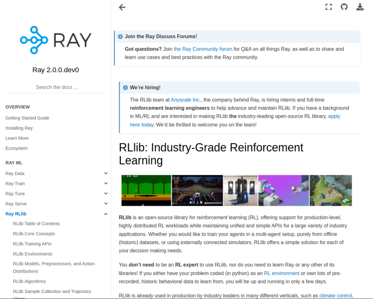
   <figcaption align="middle">Ray RLlib • <a href="https://docs.ray.io/en/latest/rllib/index.html" target="_blank">Link</a></figcaption>
  </figure>
  <figure style="margin-top:0px;margin-bottom:40px; margin-right:auto; margin-left:1%; float:left; width:30.0%;">
   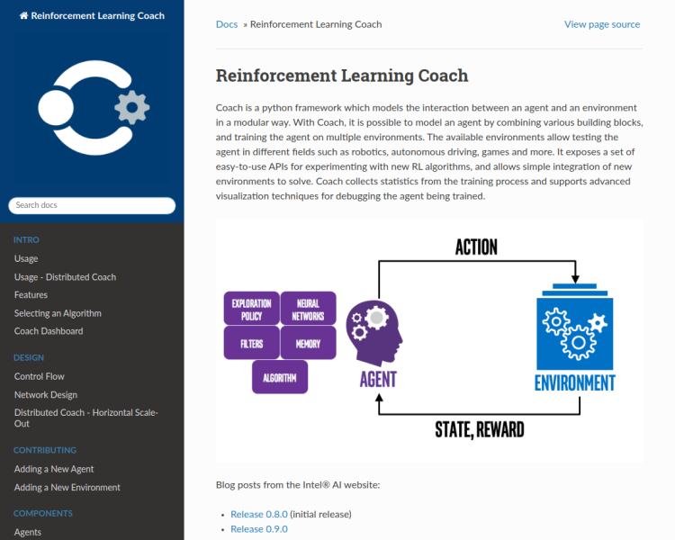
   <figcaption align="middle">Intel RL Coach • <a href="https://intellabs.github.io/coach/" target="_blank">Link</a></figcaption>
  </figure>
</div>

#### Creating an Agent

{}
All the examples presented in these sections (plus additional code) showing how to interface DIAMBRA Arena with the major reinforcement learning libraries, can be found in our open source repository <a href="https://github.com/diambra/agents" target="_blank">DIAMBRA Agents</a>.</span>
{}

##### Scripted Agents

The classical way to create an agent able to play a game is to hand-code the rules governing its behavior. These rules can vary from very simple heuristics to very complex behavioral trees, but they all have in common the need of an expert coder that knows the game and is able to distill the key elements of it to craft the scripted bot.

The following are two examples of (very simple) scripted agents interfaced with our environments, and they are available here: <a href="https://github.com/diambra/agents/tree/main/basic" target="_blank">DIAMBRA Agents - Basic</a>.

###### No-Action Agent

This agent simply performs the "No-Action" action at every step. By convention it is the action with index 0, and it needs to be a single value for `Discrete` action spaces, and a tuple of 0s for `MultiDiscrete` ones, as shown in the snippet below.

```python
import diambra.arena

if __name__ == "__main__":

    env = diambra.arena.make("doapp")

    observation = env.reset()

    while True:
        env.render()

        action = 0 if env.env_settings["action_space"][0] == "discrete" else [0, 0]

        observation, reward, done, info = env.step(action)

        if done:
            observation = env.reset()
            break

    env.close()
```

###### Random Agent

This agent simply performs a random action at every step. In this case, the sampling method takes care of generating an action that is consistent with the environment action space.

```python
import diambra.arena

if __name__ == "__main__":

    env = diambra.arena.make("doapp", settings)

    observation = env.reset()

    while True:

        actions = env.action_space.sample()

        observation, reward, done, info = env.step(actions)

        if done:
            observation = env.reset()
            break

    env.close()
```

More complex scripts can be built in similar ways, for example continuously performing user-defined combos moves, or adding some more complex choice mechanics. But this would still require to decide the tactics in advance, properly translating knowledge into code. A different approach would be to leverage reinforcement learning, so that the agent will improve leveraging its own experience.

##### DeepRL Trained Agents

An alternative approach to scripted agents is adopting reinforcement learning, and the following sections provide examples on how to do that with the most important libraries in the domain.

DIAMBRA Arena natively provides interfaces to both Stable Baselines 3 and Ray RLlib, allowing to easily train models with them on our environments. Each library-dedicated page presents some basic and advanced examples.

<div style="font-size:1.125rem;">

- <a href="./stablebaselines3/">Stable Baselines 3</a>
- <a href="./rayrllib/">Ray RLlib</a>

</div>

{}
DIAMBRA Arena provides a working interface with Stable Baselines 2 too, but it is deprecated and will be discontinued in the near future.
{}
