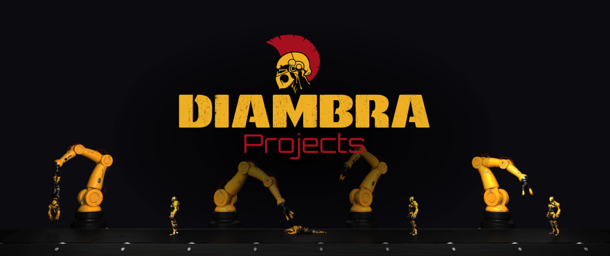

<figure style="margin-bottom:0px; margin-top:0px; margin-right:auto; margin-left:auto; width: 100%;">
  
</figure>

This section contains a collection of projects that have been developed using DIAMBRA.

If you want to add yours, you can fork the <a href="https://github.com/diambra/docs" target="_blank">docs repo</a> and submit a Pull Request or get in touch on our <a href="https://diambra.ai/discord" target="_blank">Discord server</a> and send us the material.

#### Project List

- <a href="./marlleaguetraining/">Multi Agent RL - League Training</a>
- <a href="./rlztournament/">RLZ Tournament</a>
- <a href="./gamepainter/">Game Painter</a>

