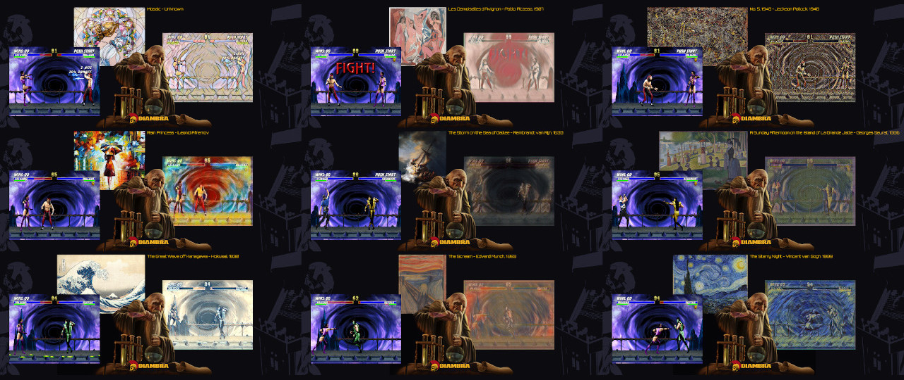

<figure style="margin-bottom:0px; margin-top:0px; margin-right:auto; margin-left:auto; width: 100%;">
  
</figure>

This section contains a collection of projects that have been developed using DIAMBRA.

If you want to add yours, you can fork the <a href="https://github.com/diambra/docs" target="_blank">docs repo</a> and submit a Pull Request or get in touch on our <a href="https://diambra.ai/discord" target="_blank">Discord server</a> and send us the material.

<<<<<<< HEAD
#### Project List

  <figure style="margin-top:20px;margin-bottom:20px; margin-right:2%; margin-left:3%; float:left; width:45.0%; border-radius: 10px; border: 1px solid #cccccc;  box-shadow: 1px 1px 2px rgba(0, 0, 0, 0.1);">
  

   
   <figcaption align="middle">
      

        <a href="./llmcolosseum/">LLM Colosseum</a>  
        This project is a proof of concept that customizes Tencent AI TLeague, a framework for Multi-Agent Reinforcement Learning based on distributed competitive self-play, and applies it to DIAMBRA Environments.
      

   </figcaption>
   

  </figure>

  <figure style="margin-top:20px;margin-bottom:20px; margin-right:auto; margin-left:2%; float:left; width:45.0%; border-radius: 10px; border: 1px solid #cccccc;  box-shadow: 1px 1px 2px rgba(0, 0, 0, 0.1);">
  

   
   

   <figcaption align="middle">
   

    <a href="./marlleaguetraining/">Multi Agent RL - League Training</a>  
        This project is a proof of concept that customizes Tencent AI TLeague, a framework for Multi-Agent Reinforcement Learning based on distributed competitive self-play, and applies it to DIAMBRA Environments.
   

   </figcaption>
  </figure>

  <figure style="margin-top:20px;margin-bottom:20px; margin-right:2%; margin-left:3%; float:left; width:45.0%; border-radius: 10px; border: 1px solid #cccccc;  box-shadow: 1px 1px 2px rgba(0, 0, 0, 0.1);">
  

   
   <figcaption align="middle">
      

        <a href="./marlleaguetraining/">Multi Agent RL - League Training</a>  
        This project is a proof of concept that customizes Tencent AI TLeague, a framework for Multi-Agent Reinforcement Learning based on distributed competitive self-play, and applies it to DIAMBRA Environments.
      

   </figcaption>
   

  </figure>

  <figure style="margin-top:20px;margin-bottom:20px; margin-right:auto; margin-left:2%; float:left; width:45.0%; border-radius: 10px; border: 1px solid #cccccc;  box-shadow: 1px 1px 2px rgba(0, 0, 0, 0.1);">
  

   
   

   <figcaption align="middle">
   

   <a href="./gamepainter/">Game Painter</a>  
   This project is an experiment that applies in real-time the style of famous paintings to popular fighting retro games, which are provided as Reinforcement Learning environments by DIAMBRA.
   

   </figcaption>
  </figure>

  <figure style="margin-top:20px;margin-bottom:40px; margin-right:52%; margin-left:3%; float:left; width:45.0%; border-radius: 10px; border: 1px solid #cccccc;  box-shadow: 1px 1px 2px rgba(0, 0, 0, 0.1);">
  

   
  

   <figcaption align="middle">
   

   <a href="./gamepainter/">Game Painter</a>  
   This project is an experiment that applies in real-time the style of famous paintings to popular fighting retro games, which are provided as Reinforcement Learning environments by DIAMBRA.
   

   </figcaption>
  </figure>

